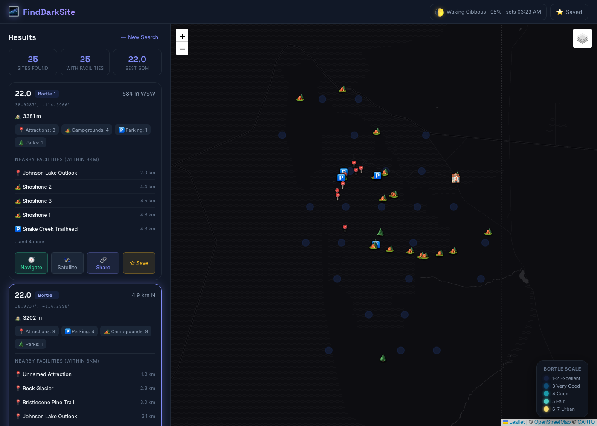

# 🌌 FindDarkSite

A dark-sky stargazing site finder that goes beyond satellite light-pollution maps. Tell it where you are; it tells you **where to actually set up your gear tonight** — combining real measurements, community-vetted spots, weather, terrain, and access checks into a single ranked answer.



## What makes a recommendation "real"

A point can be Bortle 1 on a satellite map and still be useless:
- The site is in the middle of BLM land with no drivable road.
- A small town 4 km east makes the eastern horizon glow all night.
- A ridge to the south blocks the Milky Way core.
- Tonight has 0% cloud but a 96% moon up until 3 AM.
- The forecast says clear but seeing is awful (high-altitude turbulence).
- Locals on r/Austin will tell you Reimer's Ranch needs a reservation.

FindDarkSite tries to surface all of these at once.

## Features

### Sky quality
- **WorldAtlas 2015** (Falchi et al.) for Bortle 1/2/3 gradation, plus **VIIRS 2023** as the distributable fallback. National CONUS 5 km scans baked in.
- **Bortle 1–9 colour map** with markers on a CARTO dark theme (Leaflet).
- **Moon phase + rise/set** in the header. Astronomy-grade darkness window per night.

### Tonight's conditions
- **7-day Open-Meteo forecast**: cloud %, precipitation, temperature, **dewpoint margin**, **wind**, humidity.
- **7Timer ASTRO**: **seeing** + **transparency** — the metrics astrophotographers actually decide on.
- Per-site chips: `👁️ seeing fair · 🔭 clear · 💧 dew margin 12.9° · 💨 wind 21 kph`.

### Set-up readiness (the hard part)
- **Reachability**: drivable road within 800 m of the seed point (OSM `highway`, polyline-exact distance).
- **Remoteness**: nearest town (settlement-size-weighted) + nearest `landuse=residential`.
- **Horizon profile**: DEM-sampled along 8 azimuths × 5 distances → polar SVG, max-obstruction filter.
- **Land status**: in-polygon check against OSM `boundary=protected_area` + IDA-certified Dark Sky Places (overlay).
- **Driving time** via OSRM (vs. straight-line distance).

### Community data
- **🗣️ Reddit "Locals say…"** — top stargazing threads from 50 US metro subreddits, LLM-extracted into specific spots, geocoded. Renders as a panel above results + orange pins on the map.
- **📍 GLOBE at Night** — 10,900 US citizen-science SQM measurements from 2024–25 as a togglable map layer; per-site card badge for the best nearby reading. Independently validates the satellite model.
- **🌌 IDA Dark Sky Places** — 135 certified parks/reserves/sanctuaries from Wikidata, colour-coded by designation.

### Decision aids
- **Best Nights view** — ranks (site × night) combos by a three-tier blended 0–100 score (see [Design → Layered ranking](#design) for the breakdown); each row explains which axis held it back.
- **Auto-source selection** — drops the right scan based on your location, prefers WorldAtlas over VIIRS, falls back to the national CONUS scan.
- **Geocoded location input** — lat/lng, US ZIP, or any address/place name. Nominatim under the hood, 30-day IndexedDB cache.
- **Simplified search panel** — only Location / Search Radius / Max Results are visible by default; every threshold, data-source, and enrichment toggle lives inside a collapsed `[+] Advanced filters & sources`. Most users never need to open it.
- **Share links** — `#site=lat,lng,sqm` URL pins a result for sending.
- **Favorites import/export** — JSON file you can sync between devices.

### PWA
- Installable; runs **offline** for the app shell + last-loaded scan. Map tiles + scans cached via `vite-plugin-pwa`. The `⬇️ Install` button appears when the browser supports it; a `📡 Offline` chip flips on with `navigator.onLine`.

## Quick start

```bash
git clone <your-repo-url>
cd FindDarkSite
npm install
npm run dev     # http://localhost:5173
```

The committed VIIRS national scan covers all of CONUS, so the app works immediately. To unlock **Bortle 1/2/3** gradation you need to regenerate from World Atlas 2015 — see [`docs/DEPLOYMENT.md`](docs/DEPLOYMENT.md) (5-minute, no-account-needed walkthrough).

## Design

### The pipeline

A search returns a ranked list by chaining three stages:

```
User location  ─►  Stage 1 — Dark seeds            (filter scan by SQM + radius)
                       │
                       ├──► cluster (5 km)
                       │
                Stage 2 — Per-seed context
                       │     • POI batch (Overpass: campgrounds, parks, etc.)
                       │     • Reachability (roads, settlements, residential, protected, military)
                       │     • Elevation (Open-Meteo, batched)
                       │
                Stage 3 — Top-N enrichment         (12 sites max for cost reasons)
                       │     • Weather forecast (Open-Meteo)
                       │     • Astro forecast (7Timer ASTRO)
                       │     • Driving time (OSRM)
                       │     • Horizon (Open-Meteo DEM, 40 samples each)
                       │
                       ▼
              Render with Reddit + GLOBE at Night overlays
```

Every stage is **independently failable** — Overpass / weather / 7Timer / OSRM / Nominatim all carry their own try/catch and surface errors in the UI (e.g. the red "↻ Retry facilities" banner when Overpass 503s).

### Layered ranking

The Best Nights view doesn't sort by SQM alone. Each `(site, night)` pair gets a 0–100 score split deliberately across three tiers — *when is the night good*, *how good is the site itself*, and *do real people think it's worth it*:

| Tier | Components (weight) | What it answers |
|---|---|---|
| **Tonight** (50) | cloud 20 · moon 10 · seeing 8 · transparency 6 · dew 3 · wind 2 · precip 1 | Is *this specific night* worth driving out for? |
| **Site** (35) | SQM 15 · horizon clearance 8 · town/residential distance 7 · drive time 5 | Is the *spot itself* genuinely good? |
| **Community** (15) | IDA-certified proximity 5 · Reddit-vetted proximity 5 · GLOBE-at-Night agreement 5 | Do *real astronomers and the IDA* say so? |

Hard rules layered on top of the score:
- **Unreachable sites floor remoteness + community to 0** — a Bortle 1 spot you can't drive to is useless, and we won't let IDA proximity rescue it.
- **Sites inside `landuse=military` are zeroed out the same way**.
- **IDA tier matters**: Sanctuary (1.0) > Reserve (0.95) > Park (0.85) > Community (0.7) > Urban Night Sky Place (0.55).
- **Reddit sentiment is signed**: positive proximity adds, negative proximity subtracts ("locals say skip this place" is a real signal).
- **GLOBE agreement is direction-aware**: a real meter reading higher than our model bumps the score (the model under-counts the spot); a much lower reading drops it.
- **WorldAtlas data outranks VIIRS** when both cover the same point.
- **Centered scans outrank national-bbox scans** (smaller payload, faster).

Every reason in the *held-back-by* tag and every chip in the row is sourced directly from these components, so the explanation matches the math.

### Data sources & licences

All of these are baked into the bundle by scripts in [`scripts/`](scripts/) — re-run any time to refresh:

| Source | Used for | Licence | How to refresh |
|---|---|---|---|
| **VIIRS VNL 2023** | Raster sky brightness (committed CONUS scan) | EOG, distributable | `node scanner/viirs/scan-raster.mjs` (needs EOG account, see [`docs/DEPLOYMENT.md`](docs/DEPLOYMENT.md) §4) |
| **World Atlas 2015** (Falchi) | Bortle 1/2/3 modelled brightness | **No redistribution** | `node scanner/viirs/scan-raster.mjs --source worldatlas` — local-only; never commit |
| **Wikidata** (`wdt:P1435`) | IDA-certified Dark Sky Places | CC0 | `node scripts/fetch-dark-sky-places.mjs` |
| **GLOBE at Night** | Citizen-science SQM + naked-eye observations | CC BY 4.0 | `node scripts/fetch-globe-at-night.mjs` |
| **Reddit** (50 metro subs) | Community-vetted spots | Posters' content; we link source | `node scripts/fetch-reddit-stargazing.mjs` (Playwright; needs a fresh LLM extraction pass after) |
| **OpenStreetMap (Overpass)** | POIs, roads, towns, residential, protected areas | ODbL | live, per-search |
| **Open-Meteo** | Cloud, temp, dewpoint, wind, elevation | CC BY 4.0, no key | live, per-search |
| **7Timer** | Seeing + transparency | Public | live, via Vite `/api/7timer` proxy (no CORS upstream) |
| **OSRM** | Driving time | ODbL (demo server) | live, per-search |
| **Nominatim** | Geocoding lat/lng ↔ name | ODbL, 1 req/s | live, per-search |
| **CARTO Dark Matter + Esri** | Map tiles | CARTO + Esri ToS | runtime cached for offline |

> **License rule worth repeating**: never commit any `public/data/*worldatlas*.json` file or the `public/data/index.json` entry that lists one. Falchi's terms forbid redistribution.

### Visual language

The interface leans into an **astronomical field-instrument** aesthetic rather than generic dark mode. Three accent colours are used with intent — never mixed by accident:

| Colour | Job |
|---|---|
| **Indigo** `#818cf8` | Primary action, the brand spine — search button, active card, focus ring |
| **Cyanotype** `#7dd3fc` | *Measured* / scientific signal — SQM readouts, coords, tick marks, scope-reticle corners on cards |
| **Ember amber** `#f4a261` | Community / warmth — the Reddit panel's left rule, the moon-chip dot, the "held back by" weakness label |

Four-font system, each font with a job:
- **Space Grotesk** — display headlines + the big SQM numerals
- **Inter** — body
- **JetBrains Mono** — engraved numerics (SQM, coords, distances, tracked-uppercase "instrument" micro-labels like `LOCATION` and `SEARCH RADIUS`)
- **Spectral italic** — the *why* lines in the Reddit "Locals say…" panel, where field-journal handwriting was the right energy

A handful of motifs reinforce the metaphor without being noisy: scope-reticle corner ticks fade in on result-card hover; the Bortle badge looks like a typewriter stamp; the SQM number gets a tiny mono `m·a⁻²` superscript; the 7-night forecast is rendered as a planetarium tape (cyan dashed tick rule above + vertical hairlines between cells + a ◆ on the best night); the Best Nights score is wrapped in a same-colour 1 px reticle border like a light-meter dial. The page sits on a six-layer radial-gradient star field plus an SVG turbulence-noise grain.

### Why each layer matters

- **Satellite-only (Bortle from VIIRS/WorldAtlas)** is necessary but not sufficient. It tells you *where* it's dark but not *whether you can stand there with a tripod*.
- **OSM signals (roads, settlements, military, public land)** close the "can I get there" gap.
- **DEM (horizon)** closes the "can I see the southern sky" gap.
- **Weather + astro forecast** closes the "is tonight worth it" gap.
- **Community sources (Reddit + GLOBE at Night + IDA)** close the "do real people go there" gap — and let you cross-check the model against ground truth.

The whole point is: any one of these in isolation is misleading. All of them in concert is a recommendation.

## Project structure

```
FindDarkSite/
├── index.html
├── style.css
├── vite.config.js              # dev server proxies (RIDB, lpm WMS, 7Timer) + PWA config
├── public/
│   ├── icons/                  # PWA icons (rasterized from icon.svg by scripts/build-icons.mjs)
│   └── data/
│       ├── scan_bbox_*_5km.json        # VIIRS national CONUS scan (committed)
│       ├── scan_bbox_*_worldatlas.json # World Atlas (gitignored — see DEPLOYMENT.md)
│       ├── dark-sky-places.json        # IDA-certified Dark Sky Places (Wikidata)
│       ├── sqm-reports.json            # GLOBE at Night US measurements
│       ├── reddit-locations.json       # Reddit-sourced "locals say" spots
│       └── index.json
├── src/
│   ├── main.js                 # App entry, map, UI orchestration
│   ├── finder.js               # Multi-stage search pipeline
│   ├── lightPollution.js       # VIIRS WMS queries + scan loaders
│   ├── poiSearch.js            # Overpass POI batched query
│   ├── reachability.js         # Roads/settlements/protected-area/military
│   ├── elevation.js            # Open-Meteo elevation batches
│   ├── horizon.js              # 8-azimuth DEM sampler + polar SVG
│   ├── weather.js              # Open-Meteo cloud/dew/wind night summaries
│   ├── astroWeather.js         # 7Timer seeing + transparency
│   ├── routing.js              # OSRM driving time
│   ├── astronomy.js            # SunCalc moon/sun helpers
│   ├── scoring.js              # nightScore() + Best Nights ranking
│   ├── darkSkyPlaces.js        # IDA places loader
│   ├── sqmReports.js           # GLOBE at Night loader
│   ├── redditLocations.js      # Reddit data loader
│   ├── geocode.js              # ZIP/address/coord resolver
│   ├── sharing.js              # Favorites export/import + share-link
│   └── utils.js                # Haversine, SQM/Bortle, grid, etc.
├── scanner/                    # See docs/DEPLOYMENT.md for the raster pipeline
│   ├── scan_grid.py            # Original per-point WMS scanner
│   ├── scan-grid.{cjs,js}      # Node ports of the same
│   └── viirs/                  # Raster-backed scanner (build-cache + scan-raster)
├── scripts/                    # Build-time data fetchers (CC0/CC BY/ODbL only)
│   ├── fetch-dark-sky-places.mjs
│   ├── fetch-globe-at-night.mjs
│   ├── us-metros.mjs
│   ├── fetch-reddit-stargazing.mjs
│   ├── geocode-extracted-places.mjs
│   └── build-icons.mjs
└── tests/                      # Playwright end-to-end checks (one per feature)
    ├── smoke.mjs
    ├── auto-source-check.mjs
    ├── overpass-failure-check.mjs
    ├── worldatlas-check.mjs
    ├── horizon-nights-check.mjs
    ├── pwa-offline-check.mjs
    ├── reachability-check.mjs
    ├── astro-landstatus-check.mjs
    ├── geocode-check.mjs
    ├── darksky-places-check.mjs
    └── reddit-sqm-check.mjs
```

## Refreshing the community data

Each script is idempotent and writes one file under `public/data/`:

```bash
# IDA-certified Dark Sky Places (~135 sites; Wikidata SPARQL)
node scripts/fetch-dark-sky-places.mjs

# GLOBE at Night SQM measurements (~10k US records; CC BY)
node scripts/fetch-globe-at-night.mjs

# Reddit recommendations (two-step: scrape then LLM-extract then geocode)
node scripts/fetch-reddit-stargazing.mjs            # raw → scripts/.cache/reddit-raw.json
# Then use any Claude agent to extract specific places into scripts/.cache/reddit-extracted.json
node scripts/geocode-extracted-places.mjs           # → public/data/reddit-locations.json
```

Re-run cadence we use: monthly for Reddit, quarterly for everything else.

## Tests

Each feature has a Playwright check that drives the real app in headless Chromium. Run any of them with:

```bash
node tests/<name>.mjs
```

They all start their own Vite dev server on a unique port so you can run multiple in parallel.

## Deployment

```bash
npm run build          # → dist/
```

In production the dev proxies (`/api/lp`, `/api/7timer`, `/api/ridb`) won't exist. Either deploy a server-side proxy for these endpoints or accept that:
- The live VIIRS scan path won't work in-browser (CORS).
- 7Timer requests will fail (no CORS).
- RIDB requests will leak the key in client JS.

The PWA shell + the pre-computed scans + all community data sources still work fine without proxies.

## Tech stack

- **Frontend:** vanilla JS + Vite + `vite-plugin-pwa`
- **Map:** Leaflet, CARTO Dark Matter tiles, Esri Imagery as the satellite layer
- **Astronomy:** SunCalc for moon/sun rise+set
- **Light-pollution rasters:** `geotiff` (Node-side scanner only)
- **Caching:** IndexedDB via `idb-keyval`; Workbox runtime caches for tiles + JSON
- **Icons:** `sharp` (build-time rasterizer)

## License

MIT for the code. **Data files are governed by their own licences — see the "Data sources & licences" table.**
